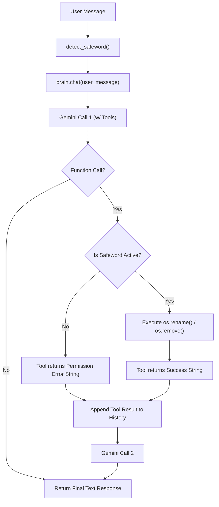

# Lithe — Walkthrough: F-05 (Basic Task Execution)

## What Was Built

Lithe now has the ability to actively modify your local file system, acting as a fully capable autonomous agent. However, to maintain strict security boundaries as a local assistant, **all destructive actions are locked behind a safeword permission wall.**

| Component | Status | Key Files |
|-----------|--------|-----------|
| **OS Tools Library** | ✅ Done | `tools.py` — Rename and delete functions |
| **Tool Execution Loop** | ✅ Done | `brain.py` — Multi-turn function calling |
| **Dynamic Safeword Wrapping** | ✅ Done | `brain.py` — Closure-based safeword injection |
| **Persona Instructions** | ✅ Done | `system_prompt.py` — Tool permission fallback rules |

---

## Architecture & Flow

---

## Key Design Decisions

### 1. Stateless Permission Wall
Lithe's `server.py` does not store chat history between HTTP requests. This made asking for permission tricky. 

**Solution:**
If Lithe tries to rename a file without the safeword, the Python tool blocks the action and returns an error string directly to Gemini: *"User permission required. Instruct them to repeat their request and include the safeword."*
Gemini then formats a polite refusal: *"I cannot rename this file without permission. Please say 'Override Lithe, rename the file'."*
When you send the new message with the safeword, the entire flow starts fresh, the safeword is detected, and the tool executes successfully on the first pass.

### 2. Dynamic Tool Wrapping
The `google-genai` SDK parses Python function signatures to figure out the tool schema. If we put `safeword_active` in the tool signature, Gemini would try to set it to `True` itself! 
To prevent this, `brain.py` dynamically creates wrapper functions *inside* the `chat()` function. These wrappers capture the `safeword_active` variable via Python closures, hiding the security mechanism from the LLM entirely.

### 3. Multi-Turn Single Request
If Gemini decides to call a tool, `google-genai` requires you to append the tool response to a chat history list and make a *second* API call to get the final human-readable answer. `brain.py` now implements this loop seamlessly, so the Electron frontend still only ever sees a single `POST` request.

---

## Validation Results

| Check | Result |
|-------|--------|
| Safeword Missing (Permission Denied) | ✅ Tool successfully blocks execution and returns error prompt |
| Safeword Present (Execution Allowed) | ✅ Tool executes `os.rename` and returns success |
| LLM Tool Calling Syntax | ✅ `tools=` parameter correctly parsed by `GenerateContentConfig` |

---

## Milestone Complete
Congratulations! All features scoped in the `FEATURES.md` roadmap (F-01 through F-06) have been fully implemented. Lithe is ready for full end-to-end user acceptance testing.
